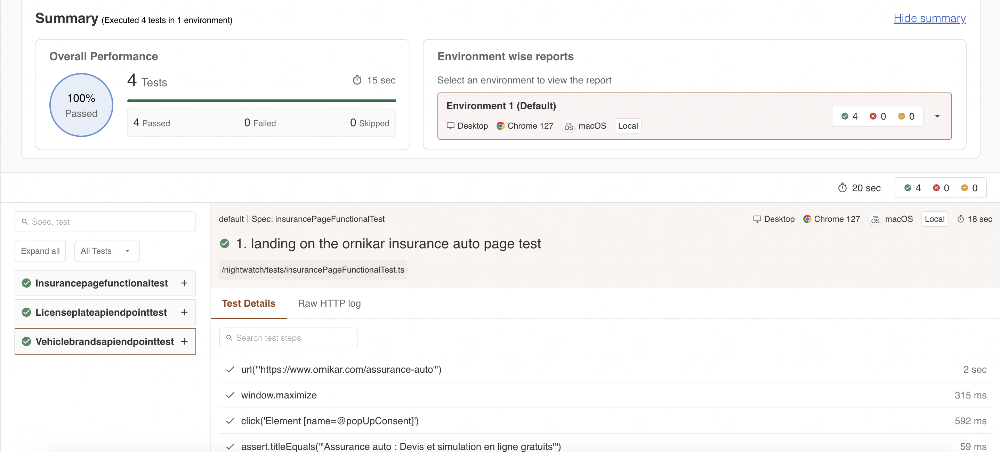

# Test Assessment Ornikar

## Overview

This project leverages **Nightwatch.js** and **TypeScript** for automated browser and API testing.

## Prerequisites

Make sure the following are installed:

- [Node.js](https://nodejs.org/en/download/) (version used: v20.11.0+)
- [npm](https://www.npmjs.com/get-npm) (version used: 10.2.4)

## Getting Started

Follow these steps to set up and run the project:

## 1. Clone the Repository

Clone the repository using the following command:

`git clone <repository-url>`

## 2. Install Dependencies

Navigate to the project directory and install the required dependencies:

`npm install`

## 3. Configuration Files

`nightwatch.conf.ts`: Configuration for Nightwatch.js

`tsconfig.json`: TypeScript configuration file

## 4. Running Tests

To run the tests, use the following npm scripts:

#### Run Tests Locally (Chrome)

`npm test`

#### Run Tests in Headless Mode

Headless mode is available for Chrome, Firefox, and Safari:

- Chrome: `npm run test:chrome:headless`
- Firefox: `npm run test:firefox:headless`
- Safari: `npm run test:safari:headless`

## 4. Available Scripts

Linting

Run the linter to check for code issues:

`npm run lint`

#

Prettier

Check code formatting:

`npm run prettier`

#

Fix Formatting

Automatically fix code formatting issues:

`npm run prettier:fix`

#

Tags

Running API related tests 

`npm run test:api'

## Test Reports

Test reports are automatically generated in the `tests_output` folder after running tests locally.

Screenshots can be found in the `screens` folder.

### CI Configuration

On every push and pull request to the main branch, a [Github actions pipeline](https://github.com/anachicioreanu/Technical-Test-Ornikar/blob/main/.github/workflows/nightwatch.yml) is triggered. The pipeline runs tests across Chrome, Firefox, and Safari, generating reports that are stored as artifacts. ([Here is an example of the artifacts generated.](https://github.com/anachicioreanu/Technical-Test-Ornikar/actions/runs/10410147371/artifacts/1817445047)).

